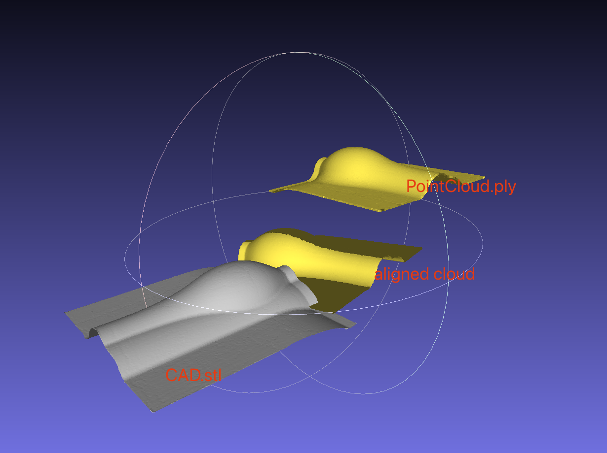

# Q2-PointCloud_Alignment
I didn't implement the icp algorithm very well. I didn't use the way suggested in the instruction. Because it's kind of tricky to find the corner of the point cloud. I used to implement a icp algorithm in a lidar SLAM algorithm where I apply points with normals instead of pure xyz points. But it seems that the performance is good. I can't use rviz because I was using docker which has x service related error. But I did saved the point cloud after optimization. Here is the comparison:\
