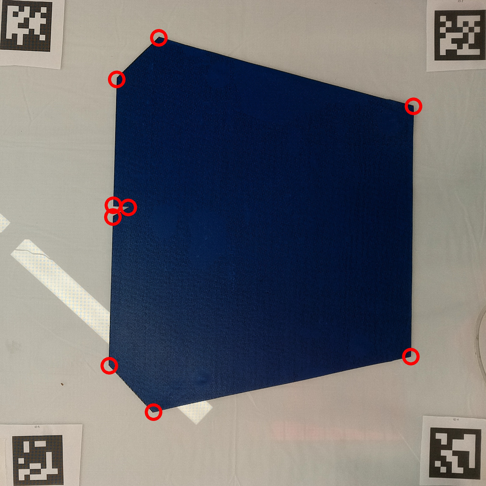
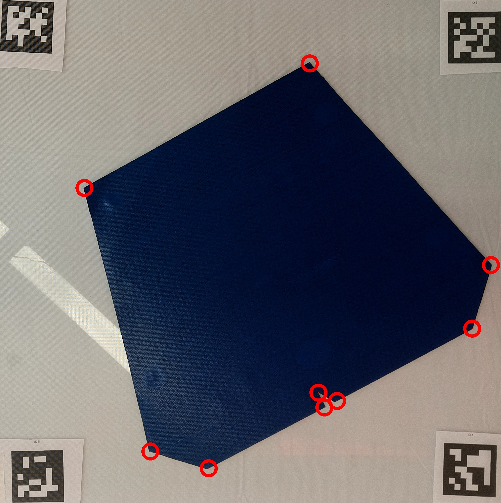

# Q4-Vision
I simply follow the given instruction to implement the algorithm
1. Detect all markers and select 4 rightmost markers. Crop the image using the 4 markers
2. Set a suitable threshold to generate the blue mask.
3. Apply `findContours` to the filtered image and apply `approxPolyDP` to find the corners
  | 71-output.jpg                               | 40-output.jpg                               |
  | ------------------------------------------- | ------------------------------------------- |
  |  |  |
