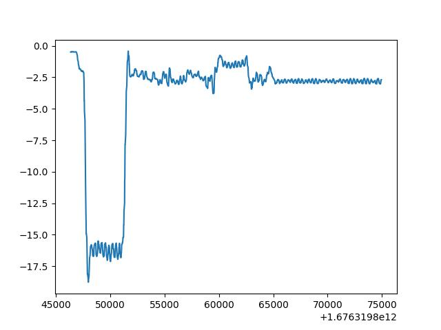

# Q5-Timeframe_Alignment
I'm trying to understand the purpose of the question. I think there should be a sudden force change in Z axis when the end effector touches the object. Here is the plot of zf with respect to timestamps\
\
I just simply select a magic number -10 as the threshold. The first time when the zf is larger than the threshold is the touch moment. Then I use the timestamp to copy all the corresponding images and data.